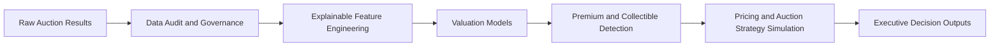

# Plate Value Intelligence

Plate Value Intelligence is a portfolio data science project for personalised-registration valuation, premium-asset detection, and auction strategy simulation.

The project uses the full 2025 DVLA auction event dataset as the core modelling base. It turns governed auction records into explainable features, valuation models, premium and collectible asset decisions, and commercial routing recommendations.

## Key Results

| Metric | Result |
|---|---:|
| Model-ready auction records | 17,782 |
| Final holdout MAE | GBP 1,248 |
| Final holdout median absolute error | GBP 621 |
| Top-decile premium capture | 55.3% |
| Collectible-potential assets identified | 507 |
| Final-event assets routed across commercial pathways | 1,981 |

## Business Problem

Large personalised-registration portfolios should not apply the same sales method to every asset. Some registrations are suitable for fixed-price listing, some need competitive auction exposure, some deserve premium showcase treatment, and some require specialist human review.

The project frames this as a decision-support problem:

- estimate an indicative valuation benchmark
- identify premium and collectible assets
- route each asset into a transparent commercial pathway
- separate standard automated cases from human-review cases
- avoid overstating reserve coverage as commercial uplift or demand forecasting

## Solution Architecture



See [docs/project_architecture.md](docs/project_architecture.md) for the data, analytical, and decision-layer view.

## What The Solution Does

- Audits the 2025 auction dataset and removes records without recorded hammer prices from price modelling.
- Builds leakage-safe, explainable plate features such as length, numeric rarity, repeated characters, format groups, and structural collectibility signals.
- Trains valuation baselines and tree-based models using event-based validation.
- Selects Random Forest as the primary valuation model after comparing Ridge, Random Forest, and HistGradientBoosting.
- Creates premium, collectible, trophy-candidate, and specialist-review decision layers.
- Converts valuation and rarity signals into Fixed Price, Standard Auction, Premium Auction / Showcase, and Specialist Review recommendations.

## Repository Walkthrough

- [01_data_audit_and_governance.ipynb](01_data_audit_and_governance.ipynb)
  - audits the 2025 auction dataset
  - checks completeness, duplicates, event coverage, and price-recording quality
- [02_plate_feature_engineering.ipynb](02_plate_feature_engineering.ipynb)
  - derives interpretable plate-level features
  - prepares the valuation-ready feature table
- [03_exploratory_pricing_analysis.ipynb](03_exploratory_pricing_analysis.ipynb)
  - explores observed pricing patterns by event, format, numeric band, and scarcity signal
- [04_valuation_baseline_models.ipynb](04_valuation_baseline_models.ipynb)
  - establishes median, plate-length, and Ridge regression valuation baselines
- [05_valuation_tree_models.ipynb](05_valuation_tree_models.ipynb)
  - evaluates Random Forest and HistGradientBoosting models
  - produces final holdout metrics, feature importance, and model artifact
- [06_premium_collectible_asset_detection.ipynb](06_premium_collectible_asset_detection.ipynb)
  - builds premium, collectible, trophy, and specialist-review decision layers
- [07_pricing_and_auction_strategy_simulation.ipynb](07_pricing_and_auction_strategy_simulation.ipynb)
  - converts holdout valuation predictions and collectibility decisions into transparent commercial routing recommendations
  - simulates indicative fixed-price and reserve-policy scenarios for retrospective decision support

## Model Results

| Model | Evaluation event | MAE |
|---|---:|---:|
| Ridge regression | B277 validation | GBP 1,259 |
| Random Forest | B277 validation | GBP 1,230 |
| HistGradientBoosting | B277 validation | GBP 1,229 |
| Final Random Forest | B278 final test | GBP 1,248 |

Final B278 median absolute error was approximately GBP 621. Final B278 top-decile premium recall was approximately 55.3%.

HistGradientBoosting had a very small validation MAE advantage, but Random Forest was selected because it had the stronger combined trade-off across premium capture, RMSE, median error, and explainability.

## Commercial Decision Results

| B278 recommended path | Count | Median observed hammer price |
|---|---:|---:|
| Fixed Price | 1,482 | GBP 1,010 |
| Standard Auction | 235 | GBP 3,260 |
| Specialist Review | 210 | GBP 6,730 |
| Premium Auction / Showcase | 54 | GBP 7,005 |

The decision layer keeps most assets in a scalable fixed-price pathway while sending high-value, collectible, or ambiguous assets to higher-touch channels.

Reserve simulation results:

- Premium Auction / Showcase retrospective reserve coverage: 100.00%
- Standard Auction retrospective reserve coverage: 75.74%

These are retrospective reserve-coverage checks. They do not estimate clearance, sell-through, bidder response, or causal revenue impact.

## Job-Posting Alignment

| Job requirement | Project evidence |
|---|---|
| Pricing science | Valuation baselines, Ridge, Random Forest, and HistGradientBoosting |
| Valuation | Final holdout price model and valuation ranges |
| Premium and collectible assets | Premium-collectibility matrix and trophy candidates |
| Dynamic pricing | Transparent policy simulation, not claimed as live optimisation |
| Auction design | Fixed price, standard auction, premium showcase, and reserve scenarios |
| Explainability | Ridge coefficients, Random Forest feature importance, and transparent business rules |
| Governance | Event split, leakage controls, specialist-review overrides, and reproducible exports |
| Commercial storytelling | Executive KPIs, routing outcomes, and decision tables |
| Demand forecasting | Identified as a future internal-data extension, not falsely claimed from public data |

## Documentation

- [Executive brief](docs/executive_brief.md)
- [Project architecture](docs/project_architecture.md)
- [Model card](docs/model_card.md)
- [Data card](docs/data_card.md)
- [CV bullets](docs/cv_bullets.md)
- [Interview story](docs/interview_story.md)

## Data Governance

The modelling base is the 2025 full event-level export:

- 18,000 lots audited
- 17,782 recorded hammer-price observations used for modelling
- 218 records without recorded hammer prices excluded from price modelling
- business key: `event_code + lot_number`
- event split:
  - B270-B276: training
  - B277: validation
  - B278: final test

The project uses leakage-safe predictor exclusions, event-based validation, an untouched final holdout, one-to-one business-key merge checks, and a no-automatic-pricing rule for specialist-review assets.

## Historical Supporting Data

The 2025 event-level export represents the core modelling distribution. Earlier Regtransfers material is retained as supporting historical evidence but is not treated as equivalent training data because it primarily represents selected high-value sales rather than complete auction catalogues.

Historical data is not used for:

- model training
- random or weighted augmentation
- cross-year price-trend estimation
- market-share estimation
- demand forecasting

It may later support an external directional consistency check, not a performance metric. See [sources/historical_data_manifest.csv](sources/historical_data_manifest.csv).

## Limitations

The public dataset does not include:

- bidder history
- bid sequence
- customer-level demand
- listing views
- conversion
- listing duration
- price elasticity
- reserve experiments
- verified unsold / withdrawn outcomes

This project should be described as a pricing and auction strategy simulation, not as a live pricing system or proof of causal commercial uplift.

## How To Reproduce

Install dependencies:

```bash
pip install -r requirements.txt
```

Notebook `01` expects the local raw file:

```text
data/raw/dvla_auction_results_2025.csv
```

Raw auction extracts under `data/raw/` are intentionally ignored by git. The repository commits processed outputs and compact report files so the project can be reviewed without publishing raw extracts.

Recommended execution order:

```text
01_data_audit_and_governance.ipynb
02_plate_feature_engineering.ipynb
03_exploratory_pricing_analysis.ipynb
04_valuation_baseline_models.ipynb
05_valuation_tree_models.ipynb
06_premium_collectible_asset_detection.ipynb
07_pricing_and_auction_strategy_simulation.ipynb
```
