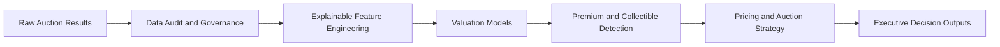

# Plate Value Intelligence

## Personalised Registration Valuation, Premium-Asset Detection and Auction Strategy

Plate Value Intelligence is a portfolio analytics project for personalised registration assets. It combines governed auction data, explainable plate features, valuation models, premium-asset screening, and commercial routing rules.

## Business Problem

A large personalised-registration portfolio should not use the same sales method for every asset.

Some registrations are suitable for standard fixed-price listing. Some have stronger upside in a competitive auction. Some should be highlighted through a premium showcase. Others need specialist human review because their value may come from rarity, cultural meaning, name similarity, or collector demand.

Poor routing can create commercial risk: a valuable asset may be under-positioned, an ordinary asset may receive too much manual effort, or pricing rules may be applied where human judgement is needed.

## Data

The main analysis uses the 2025 DVLA auction events.

- 18,000 auction lots were audited.
- 17,782 recorded hammer-price observations were used for modelling.
- 218 records did not have recorded hammer prices and were not treated as unsold observations.
- The event-based split was:
  - B270-B276: training
  - B277: validation
  - B278: final test

## Solution Architecture

## Model Results

| Model | Evaluation event | MAE |
|---|---:|---:|
| Ridge regression | B277 validation | GBP 1,259 |
| Random Forest | B277 validation | GBP 1,230 |
| HistGradientBoosting | B277 validation | GBP 1,229 |
| Final Random Forest | B278 final test | GBP 1,248 |

The final Random Forest achieved a B278 median absolute error of approximately GBP 621 and captured about 55.28% of top-decile premium assets.

HistGradientBoosting had a slightly lower validation MAE than Random Forest, but the difference was very small. Random Forest was selected as the primary model because it provided a stronger combined trade-off across premium capture, RMSE, median error, and feature-level explainability.

## Premium and Collectible Findings

| Segment | Count |
|---|---:|
| Premium + Collectible | 696 |
| Premium Value Only | 1,084 |
| Collectible Potential | 507 |
| Standard Portfolio | 15,495 |

The framework identified 558 trophy candidates and routed approximately 10.4% of the full 2025 portfolio to specialist review.

High observed value and structural collectibility are related but not identical. The 507 Collectible Potential assets are structurally strong registrations that were not already in the top-price segment. They should be treated as commercial review candidates, not as proven underpriced or missed-revenue assets.

## B278 Commercial Routing Results

| Recommended path | Count | Median observed hammer price |
|---|---:|---:|
| Fixed Price | 1,482 | GBP 1,010 |
| Standard Auction | 235 | GBP 3,260 |
| Specialist Review | 210 | GBP 6,730 |
| Premium Auction / Showcase | 54 | GBP 7,005 |

The routing groups show clear commercial separation. Most assets remain in a scalable fixed-price path, while higher-value and higher-complexity assets move to auction, showcase, or specialist review.

## Reserve Simulation

- Premium Auction / Showcase retrospective reserve coverage: 100.00%.
- Standard Auction retrospective reserve coverage: 75.74%.

Observed hammer prices exceeded the simulated reserve in these proportions. This does not estimate bidder response, clearance, sell-through, or causal revenue impact.

## Governance

The project includes:

- leakage-safe predictor exclusions
- event-based validation
- untouched B278 final holdout
- one-to-one event and lot business-key merge
- no automatic pricing for specialist-review assets
- explainable routing rules
- human-in-the-loop review
- reproducible CSV exports
- explicit data limitations

## Limitations

The public dataset does not include bidder history, bid sequence, customer-level demand, listing views, conversion, listing duration, price elasticity, reserve experiments, or verified unsold / withdrawn outcomes.

The correct framing is pricing and auction strategy simulation. It should not be presented as a production pricing engine, a causal demand model, a proven uplift study, or a mathematically final reserve policy.

## Production Roadmap

If adapted to VicRoads internal data, the next steps would be:

- listing impressions and enquiries
- bidder counts and bid sequences
- customer and segment demand
- reserve and listing-price experiments
- sell-through and time-to-sale
- semantic name and word recognition
- vehicle-brand associations
- drift monitoring
- champion-challenger model evaluation
- controlled pricing experiments
- governed human override capture
