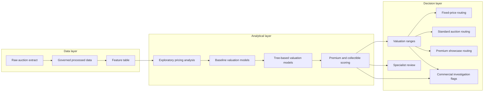

# Project Architecture

Plate Value Intelligence is structured as a portfolio decision-support pipeline. The core modelling distribution is the complete 2025 DVLA auction event dataset; historical Regtransfers material is retained only as supporting evidence.

## Design Principles

- Keep the modelling base anchored on the full 2025 event-level export.
- Use event-based validation instead of random splits.
- Keep predictor sets leakage-safe and explainable.
- Treat specialist-review assets as human-in-the-loop decisions, not automatic pricing cases.
- Present reserve and fixed-price policies as transparent retrospective simulations, not optimal pricing claims.

